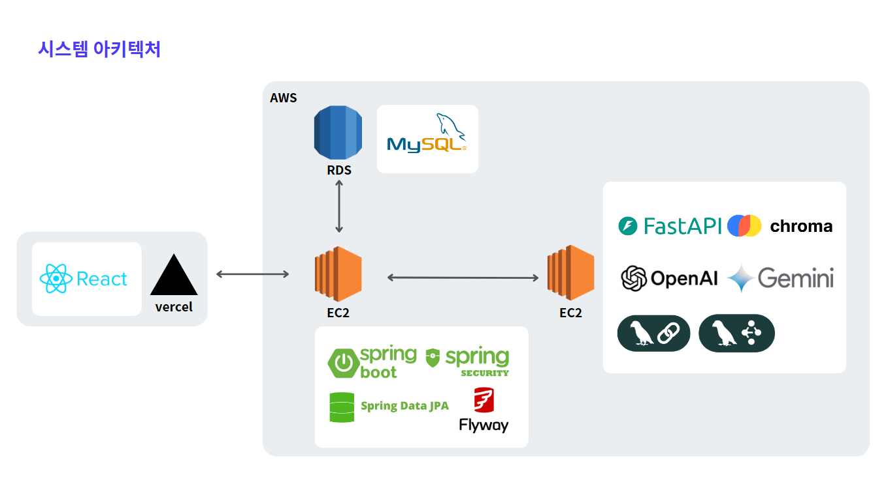

# 🤖 Jober (자버) - AI 기반 알림톡 템플릿 자동 생성 솔루션

 

## 1. 프로젝트 개요

본 프로젝트는 **(주)Jober의 공식 RFP(요구사항 제안서)**에 기반하여 진행된 기업 협업 프로젝트입니다.

이 GitHub Organization은 당시 Jober에 제안하고 개발했던 솔루션의 산출물(백엔드, 프론트엔드, AI 모델)을 관리합니다.

 

## 2. Jober의 비즈니스 요구사항

> "수십 페이지에 달하는 복잡한 가이드라인, 계속되는 승인 반려. 많은 소상공인이 템플릿 제작 단계에서부터 마케팅을 포기합니다."

Jober는 소상공인이 카카오 알림톡 마케팅을 시도할 때 겪는 가장 큰 진입 장벽이 **'템플릿 승인'** 문제임을 파악했습니다.

이에 Jober는 사용자가 원하는 메시지 내용을 간단히 입력하면, AI가 카카오 알림톡 정책에 완벽하게 부합하는 템플릿을 **즉시 생성**해 주는 솔루션을 요구했습니다.

 

## 3. 주요 기능

Jober의 요구사항을 해결하기 위해, AI가 템플릿 생성부터 정책 검증까지 자동화하는 핵심 기능을 구현했습니다.

### AI 기반 템플릿 자동 생성
사용자가 입력한 내용을 기반으로 카카오 정책(광고성/정보성, 변수 형식)을 준수하는 템플릿을 생성합니다.

### 템플릿 관리 대시보드
생성된 템플릿을 미리 볼 수 있는 관리 기능을 제공합니다.

### 사용자 인증
Spring Security와 JWT를 기반으로 회원가입, 로그인 등 안전한 사용자 인증/인가 기능을 구현했습니다.

### 통계 대시보드 (Front-End)
사용자 활동 및 템플릿 생성 통계를 시각화하는 대시보드입니다.
(*해당 기능은 프론트엔드에서 구현되었습니다.)

 

## 4. 아키텍처

 

## 5. 레포지토리

Jober 프로젝트는 3개의 레포지토리로 구성되어 있습니다.

| Repository | Description | Tech Stack |
| :--- | :--- | :--- |
| **[jober-BE](https://github.com/jober3/jober-BE)** | API 서버 및 비즈니스 로직 (Spring) | `Java` `Spring Boot` `JPA` `MySQL` |
| **[jober-FE](https://github.com/jober3/jober-FE)** | 사용자 웹 애플리케이션 (React) | `TypeScript` `React` `Vite` |
| **[jober-AI](https://github.com/jober3/jober-AI)** | 템플릿 생성 AI 모델 서버 (FastAPI) | `Python` `FastAPI`|

 

## 6. 기술 스택 (Tech Stack)

### Backend (jober-BE)
| Category | Technologies |
| :--- | :--- |
| **Core** | Java 21, Spring Boot 3.5.5 |
| **Database** | Spring Data JPA (Hibernate), MySQL, Flyway |
| **Build Tool** | Maven |
| **Infra & Deployment** |AWS EC2, AWS RDS |
| **Testing** | JUnit 5, Mockito, WireMock, H2 |

### Frontend (jober-FE)
| Category | Technologies |
| :--- | :--- |
| **Core** | React 19, JavaScript, TypeScript |
| **State Management** | Zustand 5.0.8 |
| **Routing** | React Router DOM 7.8.2 |
| **Styling** | Tailwind CSS 4.1.12 |
| **Build Tool** | Vite 7.1.2 |
| **Infra & Deployment** | Vercel |

### AI (jober-AI)
| Category | Technologies |
| :--- | :--- |
| **Core** | Python 3.11.13, FastAPI 0.115.0|
| **AI Framework** | LangChain 0.1.20 + LangGraph 0.0.25 |
| **LLM** | Google Gemini 2.5 Pro (Primary), OpenAI GPT-4 (Fallback) |
| **Vector Database** | ChromaDB 0.5.0 |
| **NLP** |  KoNLPy 0.6.0 |
| **Build Tool** | Poetry |
| **Web Server** |Uvicorn 0.32.0 |
| **Deployment** | AWS EC2 |
